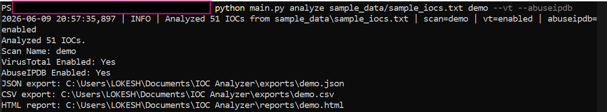
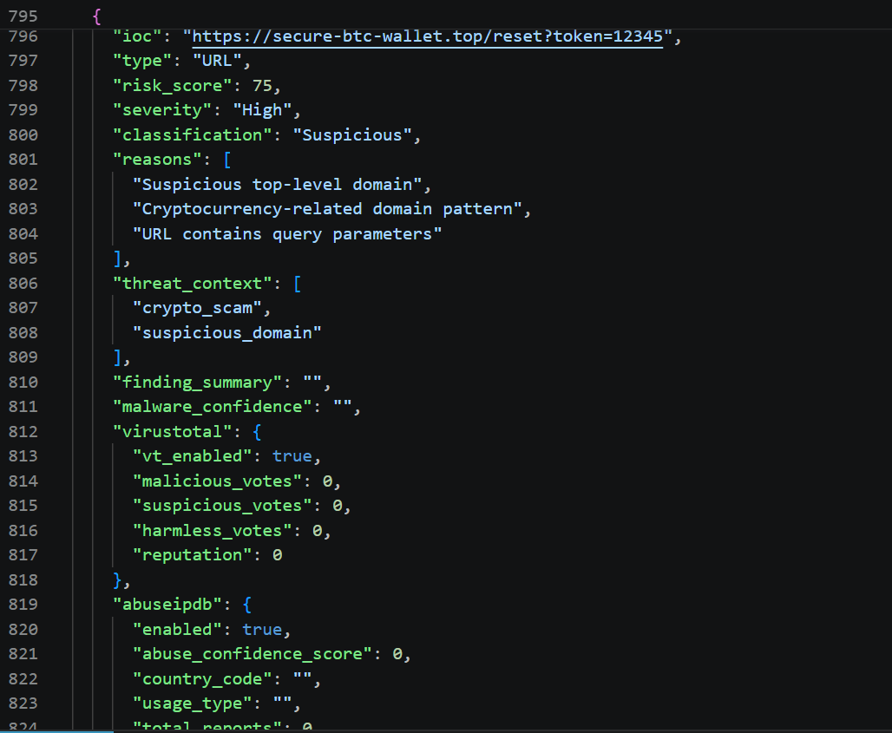
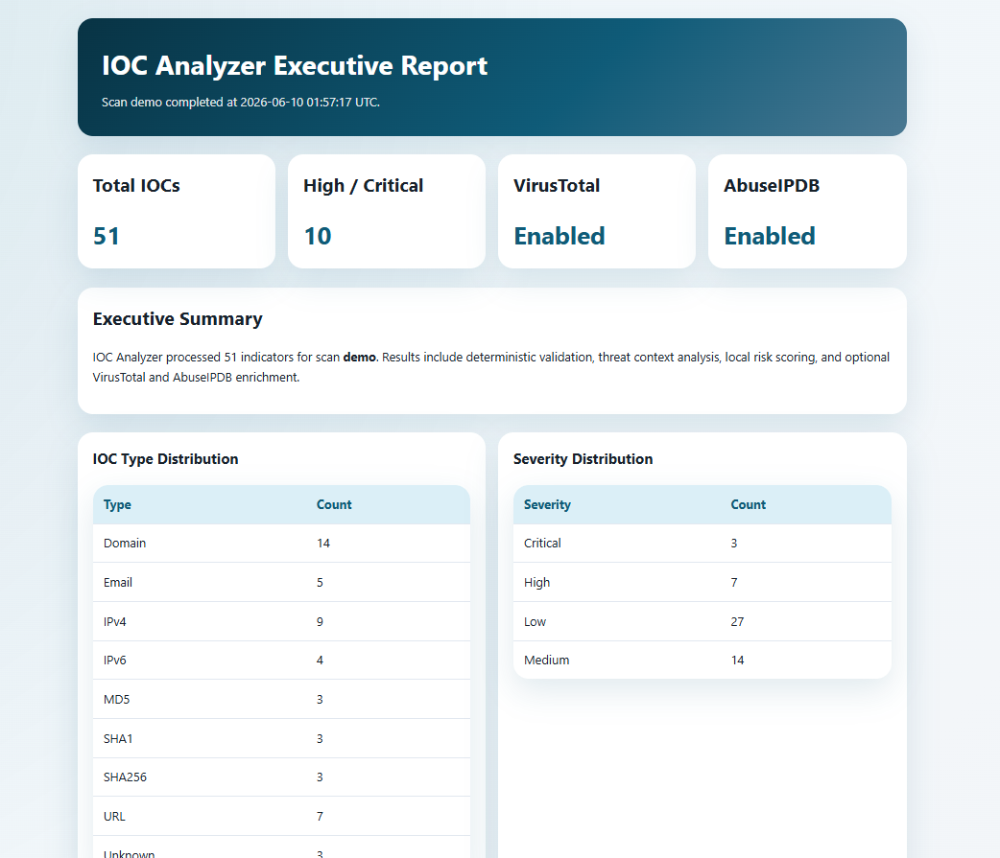
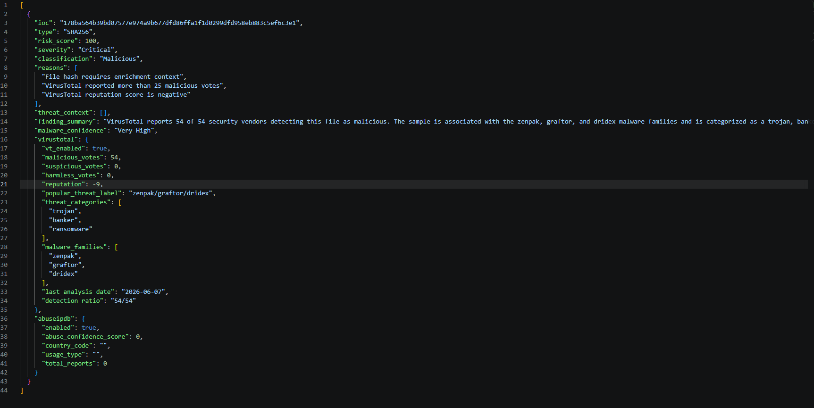
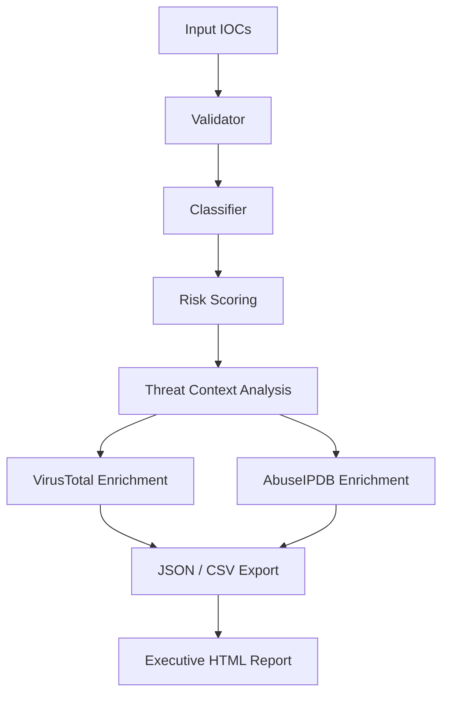

# IOC Analyzer


IOC Analyzer is a Python 3.12 threat intelligence utility that validates Indicators of Compromise, classifies them, assigns risk scores, enriches them with external reputation data, and generates uniquely named investigation artifacts for SOC and blue team workflows.

## Project Overview

This repository helps defenders process IOC datasets from TXT and CSV inputs, apply validation and low-false-positive scoring logic, add threat context labels, and produce per-scan JSON, CSV, and HTML deliverables without overwriting previous investigations.

## Features

- Detection for IPv4, IPv6, domains, URLs, MD5, SHA1, SHA256, and email addresses
- Regex- and logic-based validation pipeline
- Threat context analysis for credential theft lures, crypto scams, suspicious domains, brand impersonation, and phishing themes
- Risk scoring based on suspicious TLDs, brand impersonation, random domains, crypto scam patterns, VirusTotal reputation, and AbuseIPDB confidence
- Optional VirusTotal v3 enrichment for supported IOC types
- Optional AbuseIPDB enrichment for IPv4 and IPv6 indicators
- Threat classification into Benign, Suspicious, Malicious, and Unknown
- Unique scan naming for JSON, CSV, and HTML output artifacts
- Executive HTML reports with scan metadata and enrichment summaries
- Structured logging to `logs/analysis.log`
- Pytest coverage and GitHub Actions CI workflow

# Screenshots

## CLI Analysis



Analyze IOC datasets and generate investigation artifacts.

## Threat Intelligence Enrichment



VirusTotal enrichment provides malware family identification and threat categories.

## Executive Report



Generate executive-friendly investigation reports.

## Malware Intelligence



Extract malware families and threat categories from VirusTotal detections.

## Architecture Diagram



## Installation

```bash
python -m venv .venv
.venv\Scripts\activate
pip install -r requirements.txt
```

## Usage Examples

Analyze a TXT dataset:

```bash
python main.py analyze sample_data/sample_iocs.txt phishing_case
```

Analyze a TXT dataset with VirusTotal enrichment:

```bash
python main.py analyze sample_data/sample_iocs.txt phishing_case --vt
```

Analyze a TXT dataset with VirusTotal and AbuseIPDB enrichment:

```bash
python main.py analyze sample_data/sample_iocs.txt incident1 --vt --abuseipdb
```

Analyze a CSV dataset with auto-generated scan naming:

```bash
python main.py analyze sample_data/sample_iocs.csv
```

Validate VirusTotal API configuration:

```bash
python main.py test-vt
```

Verify existing artifacts for a scan:

```bash
python main.py export phishing_case
python main.py report phishing_case
```

## Threat Context Analysis

IOC Analyzer adds informational threat context labels without claiming ATT&CK attribution from isolated indicators. Example labels include:

- `credential_theft_lure`
- `crypto_scam`
- `suspicious_domain`
- `brand_impersonation`
- `phishing_lure`

## VirusTotal Integration

VirusTotal v3 enrichment is optional and runs when the `--vt` flag is supplied and `VT_API_KEY` is configured. Supported IOC types:

- IPv4
- IPv6
- Domains
- URLs
- MD5
- SHA1
- SHA256

When VirusTotal is enabled, the analyzer adds:

- `malicious_votes`
- `suspicious_votes`
- `harmless_votes`
- `reputation`

## AbuseIPDB Integration

AbuseIPDB enrichment is optional and runs when the `--abuseipdb` flag is supplied and `ABUSEIPDB_API_KEY` is configured. Supported IOC types:

- IPv4
- IPv6

Returned fields include:

- `abuse_confidence_score`
- `country_code`
- `usage_type`
- `total_reports`

## API Key Configuration

VirusTotal:

1. Create or sign in to your VirusTotal account.
2. Open the API key section in the VirusTotal user portal.
3. Copy your API key and store it as `VT_API_KEY`.

AbuseIPDB:

1. Create or sign in to your AbuseIPDB account.
2. Generate an API key from the account dashboard.
3. Store the key as `ABUSEIPDB_API_KEY`.

## Environment Variables

Windows:

```powershell
set VT_API_KEY=YOUR_KEY
set ABUSEIPDB_API_KEY=YOUR_KEY
```

Linux:

```bash
export VT_API_KEY=YOUR_KEY
export ABUSEIPDB_API_KEY=YOUR_KEY
```

## Unique Scan Naming

Each analysis run generates unique outputs based on the supplied scan name or an automatically generated timestamped name.

Examples:

- `exports/phishing_case.json`
- `exports/phishing_case.csv`
- `reports/phishing_case.html`
- `exports/scan_20260609_201530.json`
- `reports/scan_20260609_201530.html`

## Output Artifacts

- Per-scan JSON results in `exports/`
- Per-scan CSV results in `exports/`
- Per-scan HTML reports in `reports/`
- Activity logs in `logs/analysis.log`

## Screenshots Section

Suggested screenshots to add after running the project locally:

- CLI terminal output for `analyze sample_data/sample_iocs.txt phishing_case --vt --abuseipdb`
- Snippet of a per-scan JSON result file
- Threat Context Summary section from the HTML report
- VirusTotal Summary section from the HTML report
- AbuseIPDB Summary section from the HTML report

## Cybersecurity Skills Demonstrated

- Threat Intelligence
- IOC Analysis
- Threat Context Analysis
- Python Automation
- Risk Assessment
- Data Processing
- Security Reporting
- SOC Operations

## Resume Bullet

Built a Python-based IOC analysis platform that validates threat indicators, enriches them with VirusTotal and AbuseIPDB reputation data, assigns risk scores, and generates uniquely named JSON, CSV, and executive HTML reports for SOC workflows.

## Future Enhancements

- Integrate passive DNS and reputation feeds for enrichment
- Add analyst-defined custom threat context rules
- Support STIX/TAXII ingestion and export
- Introduce confidence scoring with analyst feedback loops
- Add REST API and web dashboard interfaces

## Repository Layout

```text
ioc-analyzer/
├── .github/
│   └── workflows/
│       └── pytest.yml
├── analyzer/
│   ├── __init__.py
│   ├── abuseipdb.py
│   ├── classifier.py
│   ├── parser.py
│   ├── scoring.py
│   ├── threat_context.py
│   ├── validator.py
│   └── virustotal.py
├── assets/
│   └── banner.svg
├── exports/
├── logs/
├── reports/
├── sample_data/
│   ├── sample_iocs.csv
│   └── sample_iocs.txt
├── tests/
│   ├── test_cli.py
│   ├── test_enrichment.py
│   ├── test_scoring.py
│   └── test_validator.py
├── .gitignore
├── CODE_OF_CONDUCT.md
├── CONTRIBUTING.md
├── LICENSE
├── README.md
├── SECURITY.md
├── main.py
└── requirements.txt
```
